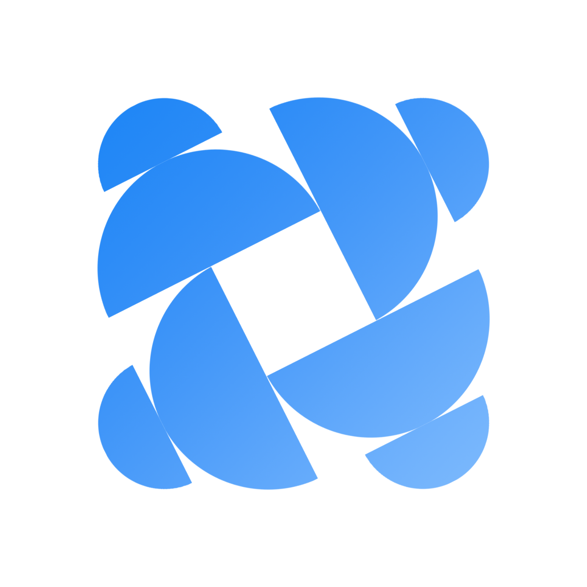

# AmarClass

<p align="center">
  <br>
  
  <br>
</p>


AmarClass is a modern academic management and student productivity app built with Flutter. It helps students stay organized through a clean dashboard, task tracking, academic scheduling, and seamless login flows designed for institutional use.

## Brand

<p align="center">
  
  
</p>

## Key Features

- Student-focused dashboard with academic overview
- Course and task tracking for semester responsibilities
- Clean login, sign-up, and password recovery experience
- OTP verification flow for secure account access
- Responsive UI built with Material Design principles
- Modern educational branding tailored for academic environments

## Screens Included

- Splash Screen
- Login Screen
- Sign Up Screen
- Password Recovery Screen
- OTP Verification Screen
- Dashboard Screen

## Tech Stack

- Flutter
- Dart
- Material Design
- Android / iOS / Web ready

## Project Structure

```bash
amarclass/
├── lib/
│   ├── main.dart
│   └── pages/
│       ├── splash_screen.dart
│       ├── login_screen.dart
│       ├── sign_up_screen.dart
│       ├── password_recovery_screen.dart
│       ├── otp_verification_screen.dart
│       └── dashboard_screen.dart
├── brandings/
│   ├── logo_black.png
│   ├── appicon_blue.png
│   ├── appicon_white.png
│   ├── icon.png
│   └── misc/
├── android/
├── web/
├── pubspec.yaml
├── README.md
└── analysis_options.yaml
```

## Getting Started

### Prerequisites

- Flutter SDK installed
- Android Studio / VS Code with Flutter extension
- An emulator or physical device

### Run the app

```bash
git clone https://github.com/your-username/amarclass.git
cd amarclass
flutter pub get
flutter run
```

## Development Notes

This project demonstrates a polished academic app interface with a focus on usability, schedule awareness, and a structured student workflow. The current UI is designed around a student dashboard and secure onboarding flow for campus-style platforms.

## License

This project is currently for educational and prototype use.

---

<p align="center">
  <sub>Built with ❤️ by RFSN.</sub>
</p>
